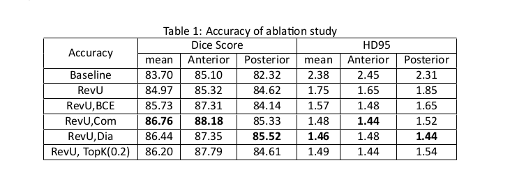
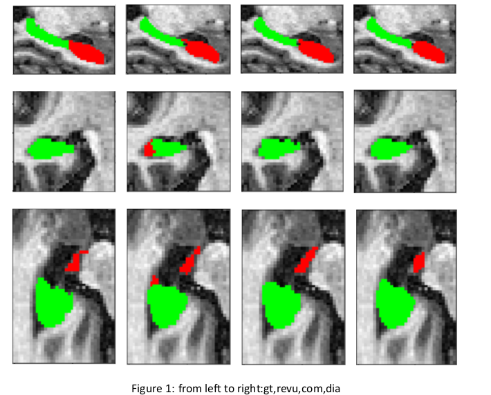

# Reversible U-net for Medical Image Segmentation
+ This repos is revised based on https://github.com/RobinBruegger/PartiallyReversibleUnet
+ The course project require us to read on a paper and then revise and modify based on original project
+ Due to the time and compuational resource limit, I deprecated the original codes with following changes:
  + Transfer from brain tumor segmentation to hippocampus segmentation
  + revise pure dice loss to BCE loss and comibination of dice loss and BCE loss to compare impact of different loss
  + add dialted convolution
  + I also try to improve the result with some machine learning tricks like top-k loss
  + I revise the original baseline model for more fair comparision(similar number of network parameters)
+ This repo will be deprecated and more update will be available at https://github.com/snilloO/rev-unet, which is a implement from scratch version and move to a mutli-task topic
+ Results from report
  + Numerical Results\
    
  + Visual Results(in slices)\
    
+ Ref and cite:
@article{PartiallyRevUnet2019Bruegger,\
         author={Br{\"u}gger, Robin and Baumgartner, Christian F.
         and Konukoglu, Ender},\
         title={A Partially Reversible U-Net for Memory-Efficient Volumetric Image Segmentation},\
         journal={arXiv:1906.06148},\
         year={2019},}